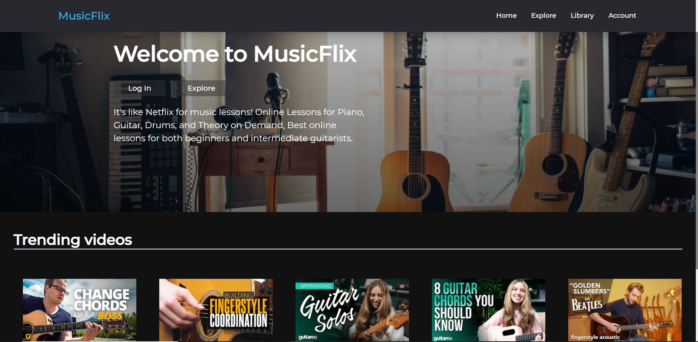
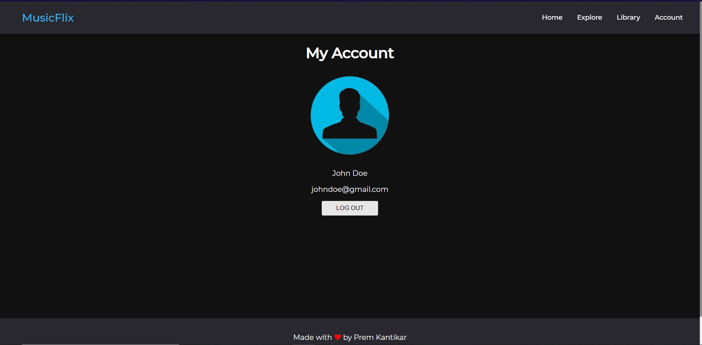
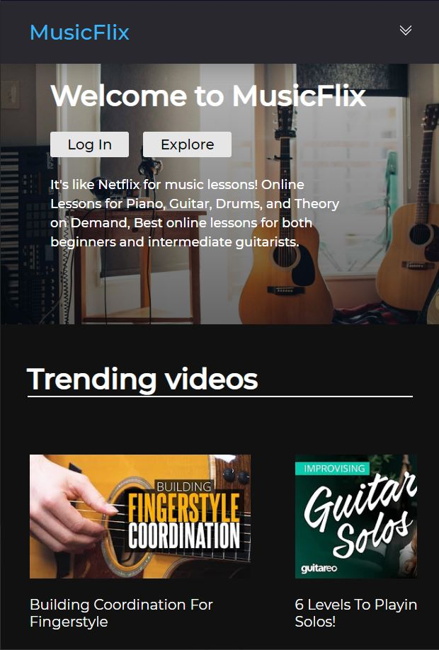

# MusicFlix - Video Library App

## Description -

MusicFlix is a Video Library for people who wanna learn how to play musical instruments and expand their knowledge about music. MusicFLix has the best tutorials playlists, curated from Youtube, to help everyone follow a definite path, that offer video series of all levels of difficulty.

MusicFLix also provides users the best experience, as they can Sign In on the Website, and like their favorite videos and add them to multiple playlists at once. And last but not least, MusicFlix is fully responsive, for it's mobile users convenience.

## Live Demo -

Open [MusicMart](https://musicflix.netlify.app/) to view it in the browser.

## Test Credentials -

* email : johndoe@gmail.com
* password : 123456

Or you can signup and create a new ID.

## Technologies Used -

1. HTML, CSS & React Js.
2. React Router.
3. Context API for state management
4. NodeJs, ExpressJS for backend.
5. MongoDB for Database.
6. JWT for authorization
7. bcrypt for Password hashing.
8. Netlify and Heroku for hosting the App.

## Screenshots -

----
----

----
----

